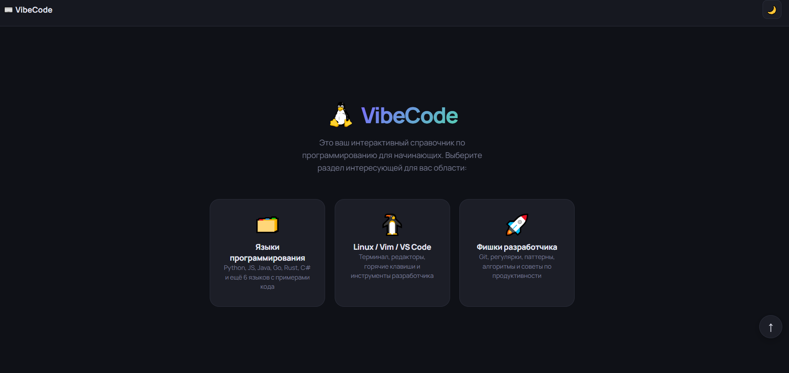

<div align="center">

```
██╗   ██╗██╗██████╗ ███████╗ ██████╗ ██████╗ ██████╗ ███████╗
██║   ██║██║██╔══██╗██╔════╝██╔════╝██╔═══██╗██╔══██╗██╔════╝
██║   ██║██║██████╔╝█████╗  ██║     ██║   ██║██║  ██║█████╗  
╚██╗ ██╔╝██║██╔══██╗██╔══╝  ██║     ██║   ██║██║  ██║██╔══╝  
 ╚████╔╝ ██║██████╔╝███████╗╚██████╗╚██████╔╝██████╔╝███████╗
  ╚═══╝  ╚═╝╚═════╝ ╚══════╝ ╚═════╝ ╚═════╝ ╚═════╝ ╚══════╝
```

**Interactive Programming Guide for Beginners**

[](https://developer.mozilla.org/en-US/docs/Web/HTML)
[](https://developer.mozilla.org/en-US/docs/Web/CSS)
[](https://developer.mozilla.org/en-US/docs/Web/JavaScript)

<p align="center">
  <a href="https://aceanomdev.github.io/VibeCode_mini-guide/" target="_blank">
    
  </a>
</p>

[](/)
[](/)
[](/)

</div>

---

## 📸 Preview

```
<p align="center">
  
</p>
```

---

## ✨ Возможности

| Раздел | Описание | Кол-во тем |
|--------|----------|:-----------:|
| 🗂️ **Языки** | Python, JS, Java, Go, Rust, C#, PHP, TS, Swift, Kotlin, Ruby, C/C++ | 12 × 10 тем |
| 🐧 **Linux** | Навигация, файлы, процессы, сеть, Vim, VS Code | 8 тем |
| 🚀 **Фишки** | Git, Regex, SSH, паттерны, Big O, дебаг, продуктивность | 8 тем |

### Фичи интерфейса

```
✅  Подсветка синтаксиса (highlight.js)   ✅  Тёмная / светлая тема
✅  Копирование кода в один клик          ✅  Навигация по содержанию
✅  Анимации при появлении секций         ✅  Адаптивная вёрстка (mobile)
✅  Модальные окна книг                   ✅  Поиск по языкам
```

---

## 📁 Структура проекта

```
vibecode/
│
├── 📄 index.html      # Разметка и структура приложения
├── 🎨 style.css       # Все стили, темы, анимации, адаптив
├── ⚙️  app.js          # Логика, контент (12 языков), книги
└── 📖 README.md
```


## 🛠️ Стек

```
┌──────────────┬───────────────────────────────────────────┐
│ Слой         │ Технология                                │
├──────────────┼───────────────────────────────────────────┤
│ Разметка     │ HTML5 (семантический)                     │
│ Стили        │ CSS3 (переменные, анимации, grid, flex)   │
│ Логика       │ Vanilla JavaScript ES6+                   │
│ Подсветка    │ highlight.js 11.9                         │
│ Иконки       │ Devicons CDN                              │
│ Шрифты       │ JetBrains Mono + Manrope (Google Fonts)  │
│ Хостинг      │ GitHub Pages (бесплатно)                  │
└──────────────┴───────────────────────────────────────────┘
```

---

## 📚 Книги

Каждый язык содержит подборку из **5 книг** с описанием — всего **60+ книг** в базе:

```
Python     →  Fluent Python, Automate the Boring Stuff, Python Crash Course...
JavaScript →  Eloquent JS, You Don't Know JS, JS: The Good Parts...
Rust       →  The Book (бесплатно!), Rust in Action, Programming Rust...
Go         →  The Go Programming Language, 100 Go Mistakes...
...и так далее для всех 12 языков
```

---

## 📄 Лицензия

```
MIT License — используй, изменяй, распространяй свободно.
```

---

<div align="center">

**Сделано с ❤️ и ☕**

*Если проект понравился — поставь ⭐*

</div>
